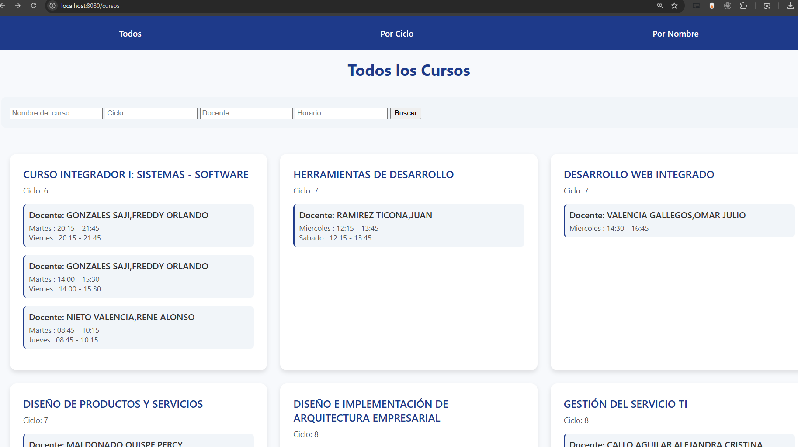
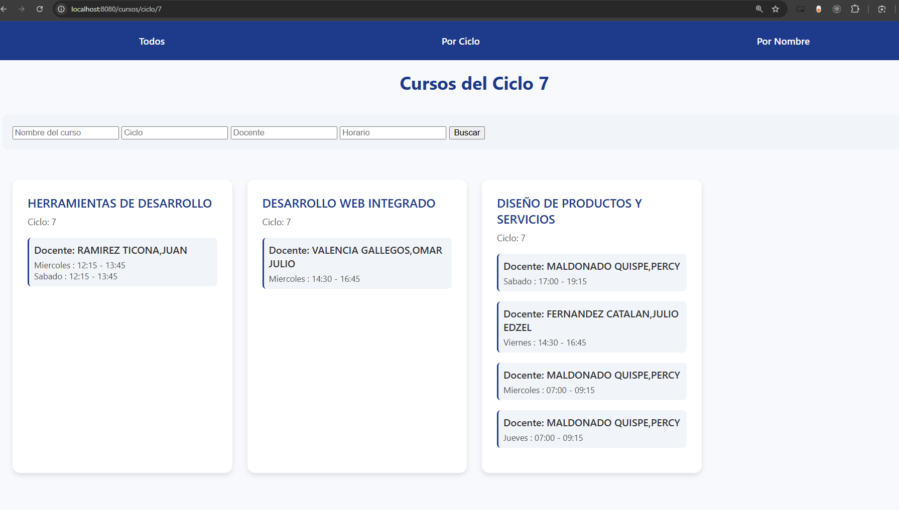
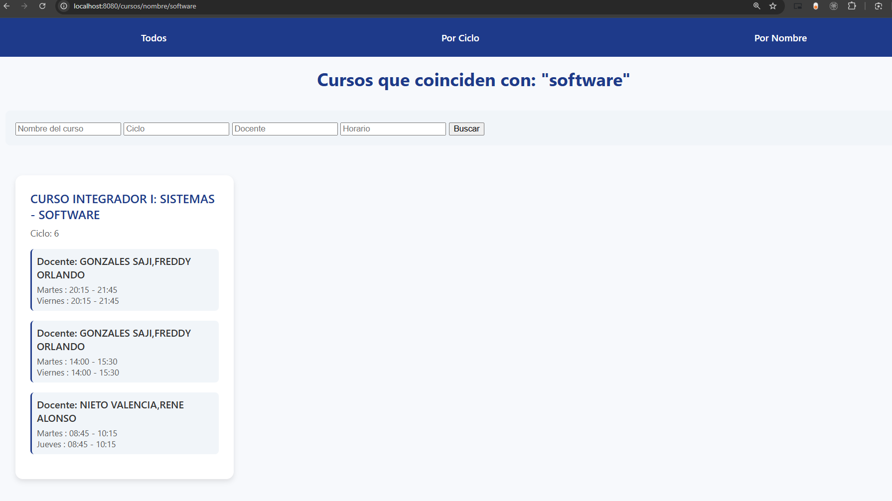
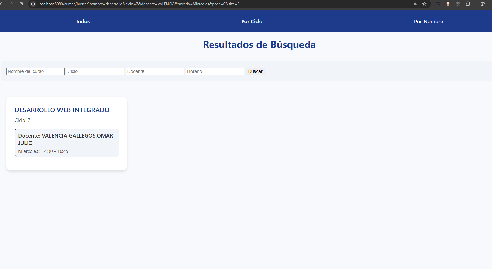
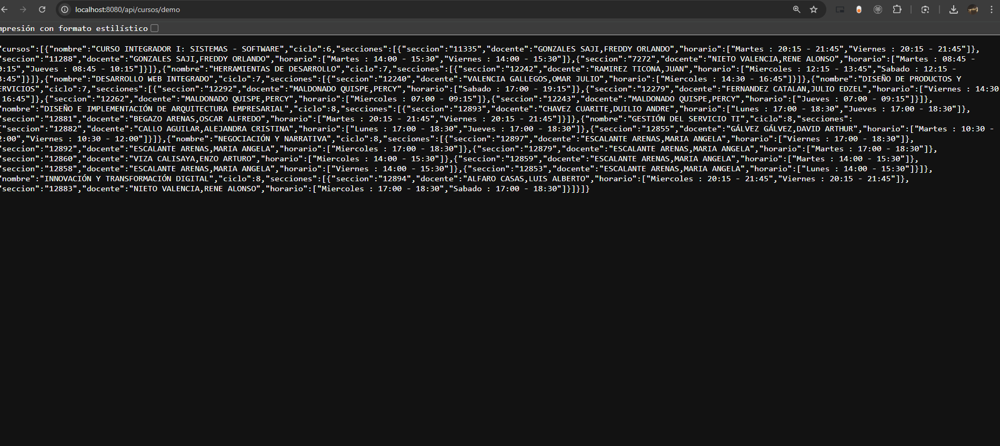
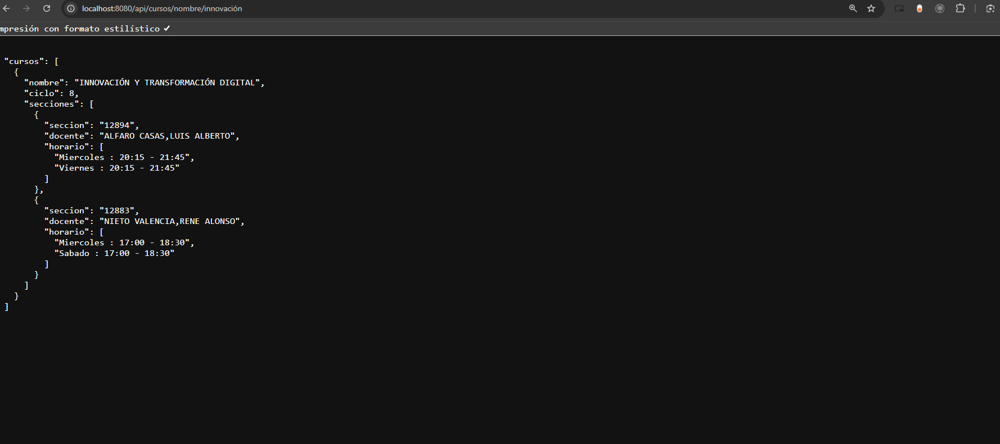
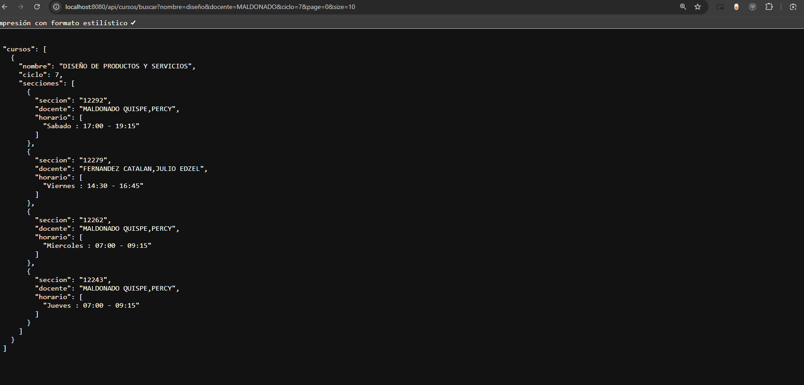

# UNIplanner

**Current Version: 0.3**

UNIplanner es una aplicación desarrollada en **Java 21** utilizando **Spring Boot**, **Maven** y **Thymeleaf**.  
El objetivo del proyecto es gestionar y visualizar cursos a partir de un archivo JSON, ofreciendo tanto una interfaz web como endpoints REST para consumo de datos en formato JSON.  

---

## Tecnologías utilizadas

- **Java 21**
- **Spring Boot 3.x**
- **Maven** como herramienta de gestión de dependencias y construcción
- **Thymeleaf** como motor de plantillas para la capa de presentación

---

## Funcionalidades actuales

- Carga automática de cursos desde un archivo `cursos.json`.
- Visualización de todos los cursos en una interfaz web con tarjetas.
- Filtro de cursos por:
  - Ciclo académico.
  - Nombre del curso.
  - Docente.
  - Horario.
- Búsqueda avanzada con múltiples filtros combinados. (optimizado: `Streaming` -> `HashMap` con indexaciones)
- Paginación en los resultados de búsqueda.
- API REST para acceder a los datos de cursos en formato JSON.
- Se puede seleccionar cursos y "guardarlos" (falta interacción de vista)
- Nuevos environments de tests

---

## Funcionalidades futuras
- Crear horario final

---

## Rutas disponibles

### Vistas (Thymeleaf)
- **Todos los cursos:**  
  `http://localhost:8080/cursos`  
  

- **Cursos por ciclo:**  
  `http://localhost:8080/cursos/ciclo/{ciclo}`  
  Ejemplo: `/cursos/ciclo/7`  
  

- **Cursos por nombre:**  
  `http://localhost:8080/cursos/nombre/{nombre}`  
  Ejemplo: `/cursos/nombre/software`  
  

- **Búsqueda avanzada (filtros opcionales + paginación):**  
  `http://localhost:8080/cursos/buscar?nombre=desarrollo&ciclo=7&docente=VALENCIA&horario=Miercoles&page=0&size=5`  
  

---

### API REST (JSON)
- **Todos los cursos (demo completa):**  
  `http://localhost:8080/api/cursos/demo`  
  

- **Cursos por ciclo:**  
  `http://localhost:8080/api/cursos/ciclo/{ciclo}`  
  Ejemplo: `/api/cursos/ciclo/7`

- **Cursos por nombre:**  
  `http://localhost:8080/api/cursos/nombre/{nombre}`  
  Ejemplo: `/api/cursos/nombre/innovación`  
  

- **Búsqueda avanzada (JSON):**  
  `http://localhost:8080/api/cursos/buscar?nombre=diseño&docente=MALDONADO&ciclo=7&page=0&size=10`  
  

---

## Requisitos

- **Java 21**
- **Maven 3.9+**
- **Spring Boot 3.x**

---

## Ejecución

Clonar el repositorio, compilar y ejecutar la aplicación con Maven:

```bash
mvn spring-boot:run
```

O también ir a `Releases` y descargar la última versión.
